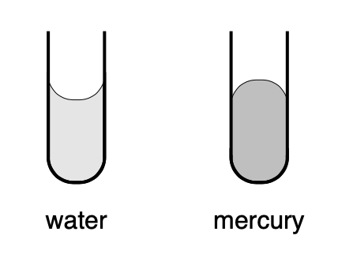

# Homework 1

## Q1

Please explain what is happening on an atomic or molecular scale that causes the phenomenon of surface tension. In particular, why is the meniscus for water in a vertical capillary tube concave and that for mercury convex?

## Q2

Assume a reservoir has homogeneous density denoted by $\rho$ and homogeneous porosity denoted by $\phi$. Initially, the pore spaces of the rocks in the reservoir is entirely filled with water. We now inject supercritical CO$_2$ into the reservoir to replace water, and denote the saturation of CO$_2$ as $S$ ($0\leq S\leq 1$). Please be careful that $\rho$ is the density of rock filled with water, not the density of rock itself.

1. Suppose $\phi=0.3$, $\rho=3000$ kg/m$^3$ before injection. Please plot how $\rho$ changes with different values of CO$_2$ saturations. What is the shape of the curve?

2. Now change $\rho=2000$ kg/m$^3$. Do the same experiment. What is the shape? Can you compare this curve to the previous one?

3. Now we stick to $\phi=0.3$, $\rho=3000$ kg/m$^3$, but inject another fluid as you like -- gas, milk, belgium beer, liquid mercury, coca cola, etc. Do the same experiment. Compare this curve to the curve you got from the first one.

## Q3

Drawing inspiration from

A. Donev et al., Improving the Density of Jammed Disordered Packings Using Ellipsoids,
Science, 303, 990--993 (2004)

D.A. Weitz, acking in the Spheres,
Science, 303, 968--969 (2004);

measure the porosity of a random close packing of M&M's. Verify your result by bringing your particular collection of M&M's to class. You can work with other kinds of cookie packs as you like.
(In addition, a brief report on your experiment, including a short discussion of how your result agrees or disagrees with what is presented in the above articles, is required.)
