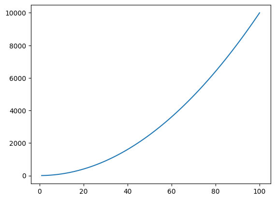
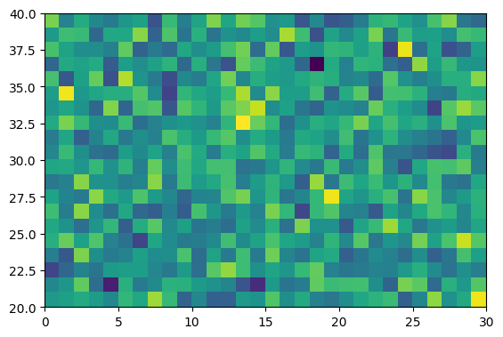

# A quick introduction to the Julia language

Getting started

Start an interactive Julia session by running julia from the command line. You can quit the session with exit(). Generally, all functions in Julia are run using parenthesis, even if there are no input arguments.


```julia
pwd()
```


    "/home/yzhang3198"


You can define Julia scripts as regular text files that end with .jl and use your favourite text editor to code. Once you have your script, e.g.:

hello-world.jl


```julia
println("Hello world")
```

    Hello world


you can run the script with include("hello-world.jl").
The Julia REPL

REPL stands for Read/Evaluate/Print/Loop and refers to the interactive Julia session (it's just like a Matlab session). It's good for experimenting, but any serious coding should be done using scripts instead.


```julia
42
```


    42


```julia
4+5
```


    9


Unlike Matlab, you can access Julia's help functions by typing the question mark, followed by the function that you want the documention of:


```julia
? exit
```

    search: exit atexit textwidth process_exited indexin nextind IndexLinear
    


```
exit(code=0)
```

Stop the program with an exit code. The default exit code is zero, indicating that the program completed successfully. In an interactive session, `exit()` can be called with the keyboard shortcut `^D`.


```julia
exit()
```

Quit the program indicating that the processes completed successfully. This function calls exit(0) (see exit).

Similarly, you can enter the shell mode by typing ;, which gives you access to a full bash terminal.


```julia
; pwd
```

    /home/yzhang3198


In contrast to Matlab, Julia treats all operators as functions. This means you can add two numbers in either of the two ways:


```julia
a = 4 + 5
```


    9


```julia
a = +(4, 5)
```


    9


The same applies for any other operations, such as subtraction, multiplications etc. Some math constants are defined in Julia by default, such as:


```julia
print(pi)
```

    π

Julia was designed with the intend to write code that resembles mathematics as close as possible. For example, you can omit the multiplication operator when working with variables:


```julia
x = 5
2x + 4    # which is the same as 2*x + 4
```


    14


Just as Matlab, but different than Python, Julia comes with many built-in math functions that you would need for everyday use:


```julia
sin(pi / 2)
```


    1.0


```julia
log(100)
```


    4.605170185988092


```julia
exp(4.3)
```


    73.69979369959579


```julia
rand()
```


    0.24072220081526052


# Packages and Plotting

Packages provide additional functionalities, that are not included in core Julia. Packages are written both by official Julia programmers, as well as anyone else who programs in Julia.

Since native Julia does not include any plotting tools, we have to download a third-party package, such as PyPlot or Plots:


```julia
using Pkg
```


```julia
Pkg.add("PyPlot")
```

      Updating registry at `~/.julia/registries/General`
      Updating git-repo `https://github.com/JuliaRegistries/General.git`
    [?25h[1mFetching: [========================================>]  99.9 %0.0 %]  14.5 %============>                            ]  29.0 %43.4 %>                ]  57.9 % [=============================>           ]  72.4 %86.7 % Resolving package versions...
     Installed AWSS3 ────────── v0.6.6
     Installed AbstractTrees ── v0.3.1
     Installed DataStructures ─ v0.17.9
     Installed ZMQ ──────────── v1.1.0
     Installed NNlib ────────── v0.6.4
     Installed ForwardDiff ──── v0.10.9
      Updating `~/.julia/environments/v1.2/Project.toml`
     [no changes]
      Updating `~/.julia/environments/v1.2/Manifest.toml`
      [1c724243] ↑ AWSS3 v0.6.5 ⇒ v0.6.6
      [1520ce14] ↑ AbstractTrees v0.2.1 ⇒ v0.3.1
      [864edb3b] ↑ DataStructures v0.17.7 ⇒ v0.17.9
      [f6369f11] ↑ ForwardDiff v0.10.8 ⇒ v0.10.9
      [872c559c] ↑ NNlib v0.6.2 ⇒ v0.6.4
      [c2297ded] ↑ ZMQ v1.0.0 ⇒ v1.1.0
      Building ZMQ ──→ `~/.julia/packages/ZMQ/ItfqT/deps/build.log`
      Building NNlib → `~/.julia/packages/NNlib/3krvM/deps/build.log`


Once you have downloaded a package, you can use it by typing:


```julia
using PyPlot
```

    ┌ Info: Recompiling stale cache file /home/yzhang3198/.julia/compiled/v1.2/PyPlot/oatAj.ji for PyPlot [d330b81b-6aea-500a-939a-2ce795aea3ee]
    └ @ Base loading.jl:1240


This plotting package is based off Python's Matplotlib package and therefore shares much of the Syntax. Some common plotting commands include:


```julia
x = 1:100;
f = x .^ 2;
plot(x, f)
```





    1-element Array{PyCall.PyObject,1}:
     PyObject <matplotlib.lines.Line2D object at 0x7fdfe39703c8>


```julia
A = randn(20,30);
imshow(A, extent=[0,30,20,40])
```





    PyObject <matplotlib.image.AxesImage object at 0x7fdfe32bcef0>


# Arrays and tuples

Arrays are defined in a similar fashion to Matlab:


```julia
x = [1, 2, 3, 4, 5]
```


    5-element Array{Int64,1}:
     1
     2
     3
     4
     5


As you can see from the output on the screen, Julia actually cares about types of variables and arrays. Since we defined our array as a collection of integers, the type of our array is `{Int64,1}


```julia
y = [1., 2., 3., 4., 5.]
```


    5-element Array{Float64,1}:
     1.0
     2.0
     3.0
     4.0
     5.0


You can make a vector out of anything, not just numbers. For example, you can collect strings in a vector like this:


```julia
s = ["This", "is", "a", "string", "vector"]
```


    5-element Array{String,1}:
     "This"  
     "is"    
     "a"     
     "string"
     "vector"


```julia
s = ["string", 4.0, sin, pi]
```


    4-element Array{Any,1}:
      "string"
     4.0      
      sin     
     π        


Multi-dimensional arrays are formed as follows:


```julia
A = [1 2 3 4; 5 6 7 8]
```


    2×4 Array{Int64,2}:
     1  2  3  4
     5  6  7  8


Note that entries of the same row are separated by spaces and rows are separated by ;

You can also initialize vectors/matrices of a given dimension in various ways:


```julia
B = zeros(4,5)
```


    4×5 Array{Float64,2}:
     0.0  0.0  0.0  0.0  0.0
     0.0  0.0  0.0  0.0  0.0
     0.0  0.0  0.0  0.0  0.0
     0.0  0.0  0.0  0.0  0.0


```julia
C = rand(2,3)
```


    2×3 Array{Float64,2}:
     0.340534  0.885904  0.101062
     0.374042  0.735454  0.87115 


```julia
D = ones(4,2)
```


    4×2 Array{Float64,2}:
     1.0  1.0
     1.0  1.0
     1.0  1.0
     1.0  1.0


Unlike Matlab, entries of matrices are accessed with square brackets, rather than parenthesis. Index counting starts at 1 (not 0).


```julia
C[1,1]
```


    0.34053376741471464


```julia
C[1,:]
```


    3-element Array{Float64,1}:
     0.34053376741471464
     0.885904149330188  
     0.10106172780311784


```julia
C[1,2:end]
```


    2-element Array{Float64,1}:
     0.885904149330188  
     0.10106172780311784


Another useful structure, e.g. for plotting is range.


```julia
r = 1:2:10
print(typeof(r))
```

    StepRange{Int64,Int64}

You can convert the vectors r to regular Julia arrays using the collect function:


```julia
collect(r)
```


    5-element Array{Int64,1}:
     1
     3
     5
     7
     9


Similar to Matlab, it is possible to reshape arrays or stack multiple arrays to form new matrices:


```julia
A = randn(3,4)
```


    3×4 Array{Float64,2}:
      0.0369507   0.927287   0.0910324  -0.823177
      1.16696    -1.96511    0.514165   -0.282542
     -0.191315    0.427349  -0.474449   -0.646095


```julia
reshape(A, 4, 3)
```


    4×3 Array{Float64,2}:
      0.0369507  -1.96511    -0.474449
      1.16696     0.427349   -0.823177
     -0.191315    0.0910324  -0.282542
      0.927287    0.514165   -0.646095


```julia
vec(A)
```


    12-element Array{Float64,1}:
      0.036950663624245546
      1.166961382172285   
     -0.19131484147164307 
      0.9272871492954569  
     -1.9651066634883936  
      0.4273486305806718  
      0.09103240076728031 
      0.5141654653005298  
     -0.4744493116000106  
     -0.8231770890847984  
     -0.2825422481869328  
     -0.6460948383122057  


```julia
B = [A; A]
```


    6×4 Array{Float64,2}:
      0.0369507   0.927287   0.0910324  -0.823177
      1.16696    -1.96511    0.514165   -0.282542
     -0.191315    0.427349  -0.474449   -0.646095
      0.0369507   0.927287   0.0910324  -0.823177
      1.16696    -1.96511    0.514165   -0.282542
     -0.191315    0.427349  -0.474449   -0.646095


One of the pitfalls of Julia is that assigning an array with the equal sign, does not copy the array, but creates a referece.


```julia
A = ones(2,3)
```


    2×3 Array{Float64,2}:
     1.0  1.0  1.0
     1.0  1.0  1.0


```julia
B = A
```


    2×3 Array{Float64,2}:
     1.0  1.0  1.0
     1.0  1.0  1.0


```julia
A[1,:] .= 2
println(A)
```

    [2.0 2.0 2.0; 1.0 1.0 1.0]


```julia
show(B)
```

    [2.0 2.0 2.0; 1.0 1.0 1.0]

To copy an array, use the copy function


```julia
A = ones(2,3)
```


    2×3 Array{Float64,2}:
     1.0  1.0  1.0
     1.0  1.0  1.0


```julia
B = copy(A)
```


    2×3 Array{Float64,2}:
     1.0  1.0  1.0
     1.0  1.0  1.0


```julia
A[1,:] .= 2
println(A)
```

    [2.0 2.0 2.0; 1.0 1.0 1.0]


```julia
println(B)
```

    [1.0 1.0 1.0; 1.0 1.0 1.0]


We see that B has not been changed!

Some other differences between Matlab and Julia are min and max functions. These functions only return the min/max of two input variables:


```julia
min(5,100)
```


    5


To obtain the smallest/largest entry of a vector, use the minimum and maximum functions:


```julia
x = [1,2,3,4,5,6]
println(minimum(x))
println(maximum(x))
```

    1
    6


# Controll Flow

Control flow in Julia, i.e. if/else statements, for loops or while loops, are similar to other programming languages. Here are some examples of different ways of controlling the flow:


```julia
for j=1:2:8
    println(j)
end
```

    1
    3
    5
    7


```julia
for color in ["red", "green", "blue"] # an array
    print(color, " ")
end
```

    red green blue 


```julia
x = 10
while x > 1
    x -= 1
    println(x)
end
```

    9
    8
    7
    6
    5
    4
    3
    2
    1


```julia
name = "Julia"
if name == "Julia"
   println("I like Julia")
elseif name == "Python"
   println("I like Python.")
   println("But I prefer Julia.")
else
   println("I don't know what I like")
end
```

    I like Julia


# Functions

Functions are a useful building block to structure your code and build subroutines etc. The most generic way to define functions in Julia is like this:


```julia
function my_function(arg1, arg2)
    # do some work
end
```


    my_function (generic function with 1 method)


Functions can have any number of input arguments, including none:


```julia
function breakfast()
   maketoast()
   brewcoffee()
end
```


    breakfast (generic function with 1 method)


By default, Julia functions always return the output from the last line of function. By using the return keyword, you can indicate a specific value that should be returned.


```julia
function my_func(x, y)
    x_new = 2x
    y_new = 2y
end
z = my_func(3,4)
```


    8


```julia
function my_func(x, y)
    return x_new = 2x
    y_new = 2y
end
z = my_func(3,4)
```


    6


By grouping results as tuples, it is possible to return multiple variables:


```julia
function my_func(x, y)
    x_new = 2x
    y_new = 2y
    return (x_new, y_new)
end
z = my_func(3,4)
```


    (6, 8)


```julia

```
